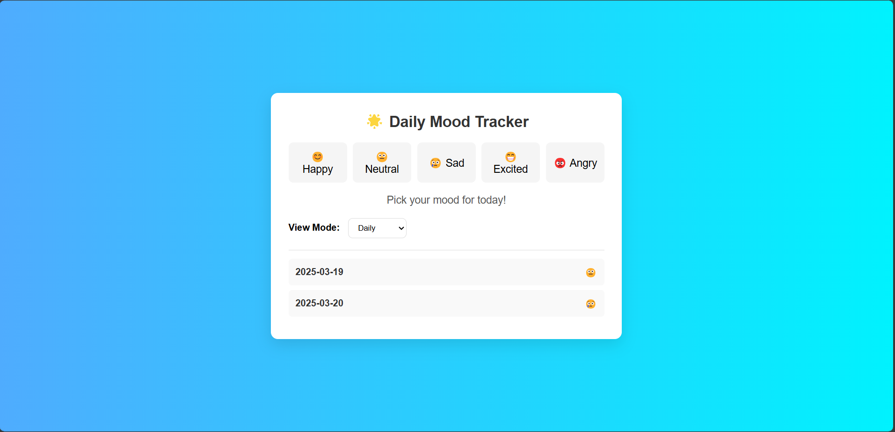
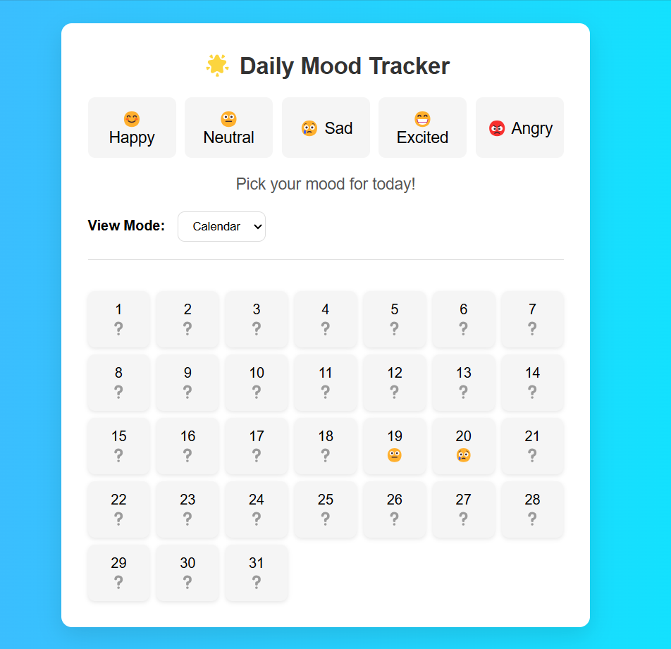
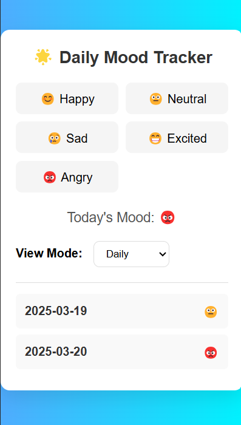

# Mood Tracker App

## Introduction
The **Mood Tracker App** is a simple and intuitive web application designed to help users log and monitor their daily moods. By tracking mood trends over time, users can gain insights into their emotional well-being and identify patterns that may impact their mental health.

## Features

### 1. Mood Logging
- Users can log their mood by selecting predefined mood buttons.
- Moods are stored in `localStorage` for persistence.
- Users can update their mood for a specific day.

### 2. Date-Based Mood Tracking
- A calendar input allows users to select a date to log or review moods.
- Users can filter mood logs based on the selected date.

### 3. Mood History & Filtering
- Displays mood logs for a selected day.
- Users can filter mood logs using a dropdown menu.

### 4. Calendar View Integration
- Mood logs are visually represented in a calendar format.
- Updates the calendar when moods are logged.

### 5. Persistent Storage
- Moods are saved in `localStorage`, ensuring data is available across sessions.

## Screenshots

## Deployment Link
[Check Here](https://om-patel-assignment-1.netlify.app)